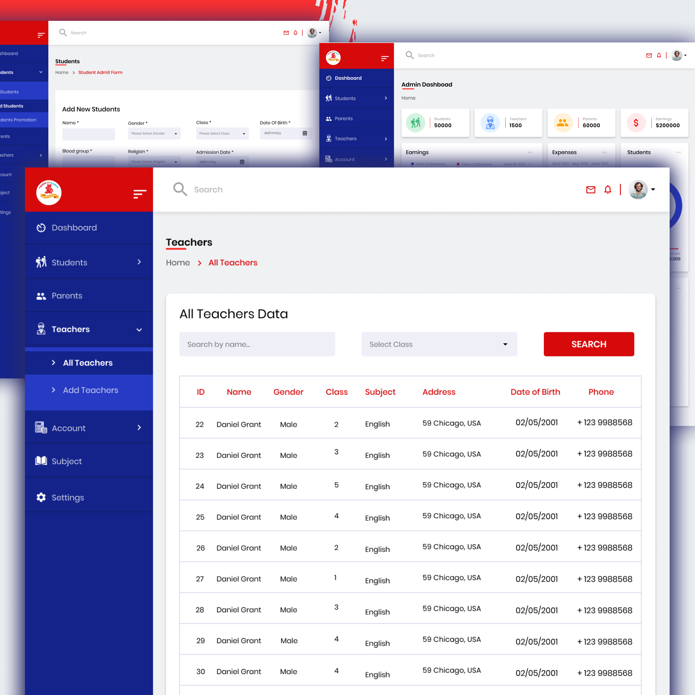

# Kids In Kare Daycare

We developed and have been managing the website for Kids in Kare, a premier child daycare and preschool learning center. The center offers various programs focusing on cognitive and emotional development for children from infants to school-aged kids.

Website features:

- **User-Friendly Interface:** Intuitive navigation and an appealing design that enhances user experience.
- **Detailed Program Information:** Comprehensive descriptions of all childcare programs and services.
- **Staff Profiles:** Information about the highly qualified and dedicated teaching staff.
- **Photo Gallery:** Visual insights into the daycare environment and activities.
- **Contact Options:** Easy-to-use contact forms and scheduling tools for tours and enrollments.
- **Parent Resources:** Access to valuable information and updates through a blog and newsletters.
- **Mobile Responsiveness:** Optimized for use on all devices, ensuring accessibility for parents on the go.

Note: Code not shared due to agreement with client.

